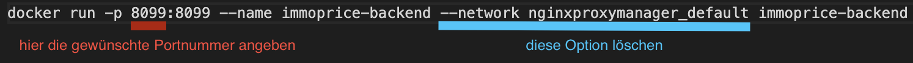
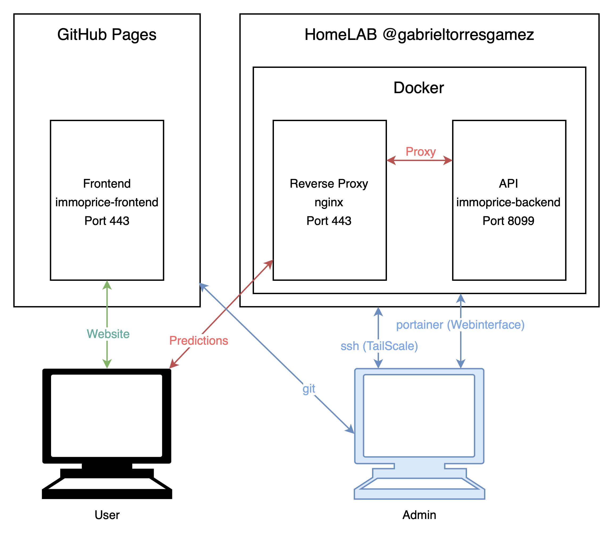

#repositories 
# immoprice-backend
## Setup
Um die API auf einer Docker Umgebung zu nutzen, muss man die vorgefertigte Datei [create_docker_container.sh](https://github.com/Immobilienrechner-Challenge/immoprice-backend/blob/main/create_docker_container.sh) starten und den Container Port 8099 anhand einem nginx Reverse Proxy freigeben. 
### Setup ohne Forward Proxy
Falls man die API nicht hinter ein nginx Reverse Proxy laufen lassen will, müsste man die Netzwerkeinstellungen in der [create_docker_container.sh](https://github.com/Immobilienrechner-Challenge/immoprice-backend/blob/main/create_docker_container.sh) Datei anpassen:

## Hosting
Das Hosting des Backends findet auf einer Docker Umgebung statt. Alle anfragen werden durch den Reverse Proxy auf api.immoprice.ch auf das Backend weitergeleitet. 

## Schnittstellen
Hier werden die relevanten Schnittstellen erfasst:
| URL                                         | Request Type | Beschreibung                             | Inputs                                                                      | Output       | Beispiel |
|:------------------------------------------- |:------------ |:---------------------------------------- |:--------------------------------------------------------------------------- |:------------ | -------- |
| [model1/](https://api.immoprice.ch/model1/) | GET          | Testmodell zur Entwicklung des Frontends | living_space(float)   type(category)  rooms(float)  gde_tax(float) | price(float) | [Hier](http://api.immoprice.ch/model1/?living_space=105&type=flat&rooms=5.5&gde_tax=4) |
### Cross-Origin Restrictions
Es können Cross-Origin Restriction Fehler auftauchen, da die API konfiguriert ist, Anfragen aus https://immoprice.ch zu verarbeiten. Falls dies auftritt, muss die Option im Browser manuell deaktiviert werden.