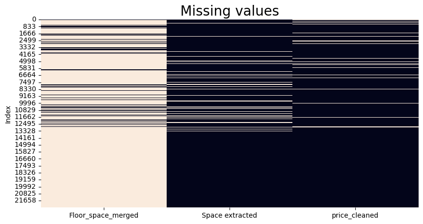
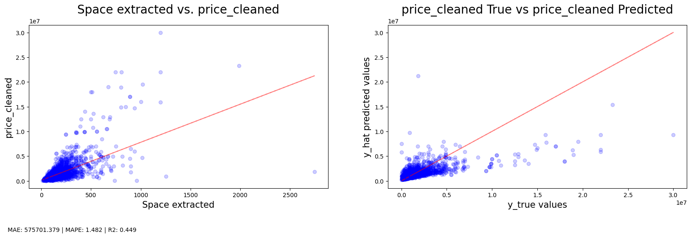
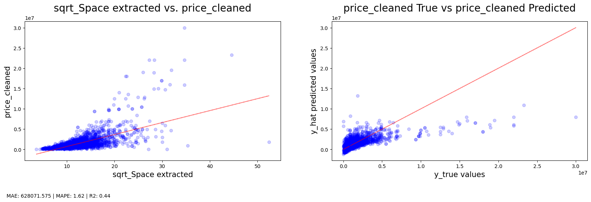
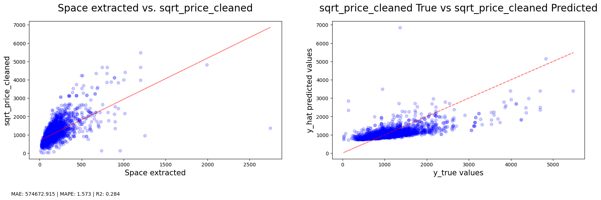
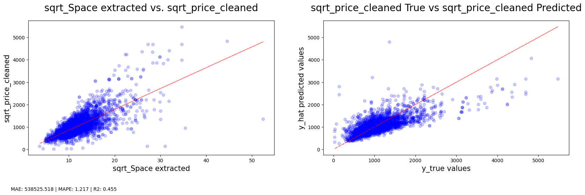
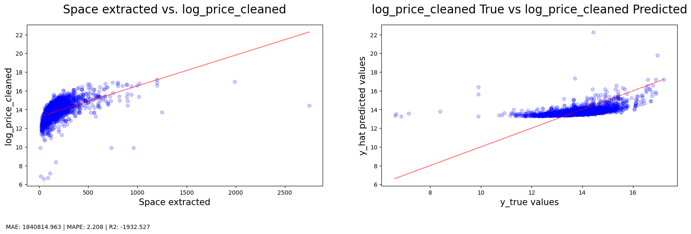
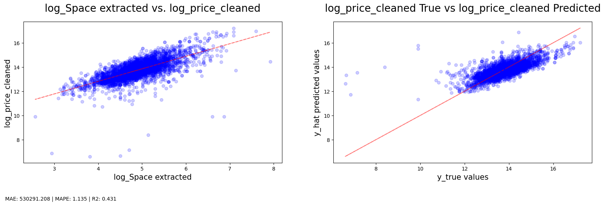
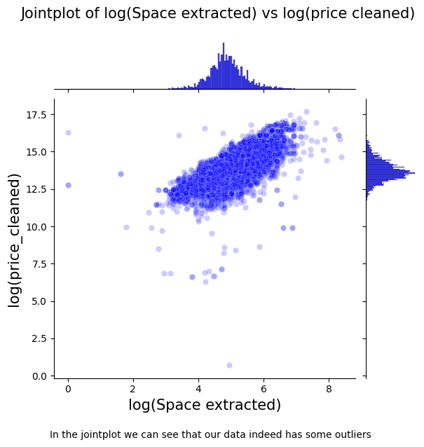
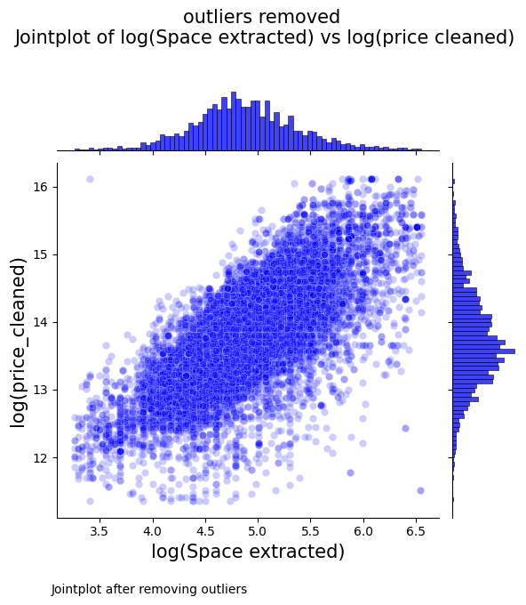
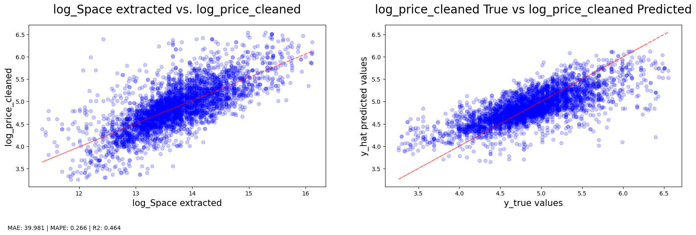

# 2.1 Einfache lineare Regression und Residuenanalyse

Challenge: cml1/3Db Immobilienrechner  
Team: Alexander Shanmugam, Si Ben Tran, Gabriel Torrez Gamez, Haris Alic  
Aufgabe: 2.1 Einfache lineare Regression und Residuenanalyse

Verwende ein einfaches lineares Modell zur Vorhersage von `price_cleaned` mit dem Attribut `Space extracted` oder `Floor_space_merged` (es gibt einige, wo beide fehlen (um die 800, können ignoriert werden).

Entwickle das Modell in einem Notebook. Untersuche dabei ob die Annahmen eines linearen Modells erfüllt sind mit geeigneten Darstellungen. Wie können Variablen-Transformationen verwendet werden, um die Modellvoraussetzungen besser zu erfüllen und das Modell zu verbessern?

Rapportiere und diskutiere die erreichte Genauigkeit der Vorhersage mit mehreren sinnvollen Metriken und auf unabhängigen Testdaten.

Abgabe

Notebook und daraus erstellter Bericht (ohne Code) als pdf.

---

# Pipeline

Zuerst werden die Daten eingelesen. Mehr informationen dazu sind im Jupyter Notebook vorhanden.

---

# Daten bearbeiten

Hier in diesem Abschnitt schauen wir uns die Spalten genauer an und entscheiden daraufhin, welche Feature wir fuer unser simples lineares Regressions Modell verwenden wollen.

Die Fläche in Beige representiert nicht vorhandene Werte (NA's). Die schwarze Fläche representiert vorhandene Werte.

Wir entscheiden uns für das Feature space_extracted und als Target price_cleaned.  
Floor_space_merged wird für das lineare Regressionsmodell nicht verwendet, da über 10000 fehlende Werte im Feature vorhanden sind. Dies erkennen wir einerseits am Barplot und andererseits an der Heatmap. 

---

# Verteilungen

Wir plotten die Verteilung von space_extracted und price_cleaned um zu sehen, wie die Verteilung der Daten vorliegt.

## Verteilung von space_extracted & price_cleaned

Wir erkennen in beiden Verteilungsplot, dass space_extraced und price_cleaned nicht normalverteilt sind. Es sieht aus, wie eine Rechtsschiefe Verteilung. Es gibt einige Werte bei Space_extraced und price_cleaned die sehr hoch sind und somit die Verteilung beeinflussen.
Mittels geeigneter Transformationen durch sqrt oder log, koennen wir die Verteilung der Daten veraendern. Der Grund, warum wir die Transformationen durchfuehren basiert auf den Bedinungen der Residuenanalyse, die im naechsten Abschnitt behandelt wird.

## Verteilung von sqrt_space_extracted & sqrt_price_cleaned
  

Durch die Wurzel Transformation erhalten wir fuer spaec_extracted und price_cleaned eine annaehrend normalverteilte Verteilung.

## Verteilung von log_space_extracted & log_price_cleaned

Analog zur Wurzel Transformation, erhalten wir durch den log Transformation eine annaehrend normalverteilte Verteilung fuer space_extracted und price_cleaned.

---

# Funktion Lineare Regression mit Residuenanalyse

---
# Modell 1 - Linear Regression mit space extracted & price_cleaned

## Modell 1 - Resultate und Interpretation

Ein Lineares Regressionsmodell ohne Transformation der Daten liefert uns folgende Ergebenisse:

- MAE   : 575701
- MAPE  : 1.482
- R2    : 0.449

Wir erkennen im Streudiagramm, das space_extracted und price_cleaned nicht linear korrelieren. Ein Indiz dafuer gibt uns auch der R2.

Aufgrund der Residuenanalyse erkennen wir, dass die Annahmen des linearen Regressionsmodells nicht erfuellt sind. Die Residuen sind nicht unabhaengig voneinander. 

Durch Transformationen von der x-Achse oder y-Achse koennen wir ueberpruefen, ob die Annahmen des linearen Regressionsmodells erfuellt werden. Dies geschieht im naechsten Abschnitt

---
# Modell 2 - Linear Regression mit sqrt_space_extracted & price_cleaned

 

## Modell 2 - Resultate und Interpretation

Ein Lineares Regressionsmodell mittels sqrt Transformation von space_extracted liefert uns folgende Ergebenisse:

- MAE   : 628072
- MAPE  : 1.62
- R2    : 0.44

Die Transformation mittels sqrt von space_extraced ergibt uns per se kein besseres Modell verglichen zum ersten Modell. 

Aufgrund der Residuenanalyse erkennen wir, dass die Annahmen des linearen Regressionsmodells nicht erfuellt sind. Die Residuen sind nicht unabhaengig voneinander, sondern folgen einer Kegelform Muster.

Im naechsten Abschnitt nehmen wir die Transformation von price_cleaned vor und schauen uns an, ob sich das Modell verbessert.

---
# Modell 3 - Linear Regression mit pace_extracted & sqrt_price_cleaned

    

 

## Modell 3 - Resultate und Interpretation

Ein Lineares Regressionsmodell mittels Transformation von price_cleaned liefert uns folgende Ergebenisse:

- MAE   : 574673
- MAPE  : 1.573
- R2    : 0.284

Wir erkennen, durch die Transformation der Targetvariabel price_cleaned wird das Modell nicht besser sondern schlechter verglichern zu den ersten beiden Modellen.

Ein nun interessantes Modell ist das Modell 4, welches wir dann beide Achsen mittels sqrt transformieren werden, um zu sehen, ob sich das Modell verbessert und die Bedingungen der Residuenanalyse erfuellt.

---
# Modell 4 - Lineare Regression mit sqrt_space_extracted & sqrt_price_cleaned
 

## Modell 4 - Resultate und Interpretation

Ein Lineares Regressionsmodell mittels Wurzeltransformation von space_extraced und price_cleaned liefert uns folgende Ergebenisse:

- MAE   : 538526
- MAPE  : 1.217
- R2    : 0.455

Durch die Wurzeltransformationen beider Achsen verbessert sich das Modell einwenig. Dies erkennen wir am MAPE und am R^2.
Der MAPE ist tiefer und der R^2 hoeher. 

Aufgrund der Residuenanalyse erkennen wir, dass die Annahmen des linearen Regressionsmodells nicht ganz erfuellt werden. Die Residuen sind annaehrend unabhaengig voneinander, folgen jedoch leicht einem Kegelmuster. Dafuer haben die Residuen einen Erwartungswert von 0 und sind Normalverteilt.

---
# Modell 5 - Lineare Regression mit log_space_extracted & price_cleaned
 

 

## Modell 5 - Resultate und Interpretation

Ein Lineares Regressionsmodell mittels Log Transformation von space_extraced liefert uns folgende Ergebenisse:

- MAE   : 690371
- MAPE  : 2.237
- R2    : 0.345

Durch die Logarithmische Transformation von space_extraced wird das Modell verglichen zur sqrt Transformation beider Achsen schlechter. Dies ist deutlich am MAPE erkennbar, da diese nun deutlich hoeher ist und der R^2 tiefer wurde. 

Aufgrund der Residuenanalyse erkennen wir, dass die Annahmen des linearen Regressionsmodells nicht erfuellt werden. Die Residuen sind nicht unabhaengig voneinander. Der Erwartungswert und die Verteilung der Residuen sind dafuer in Ordnung. 

Vollstaendigkeitshalber transformieren wir in naechsten Abschnitt nur die Targetvariabel price_cleaned mittels log Transformation.

---

# Modell 6 - Lineare Regression mit space_extracted & log_price_cleaned

 

## Modell 6 - Resultate und Interpretation

Ein Lineares Regressionsmodell mittels Log Transformation von price_cleaned liefert uns folgende Ergebenisse:

- MAE   : 1840815
- MAPE  : 2.208
- R2    : -1933

Durch die logarithmische Transformation von nur price_cleaned wurde das Modell noch schlechter. Analog ist dies bei der Wurzeltransformation von nur price_cleaned zu beobachten. Dieses Modell ist somit nicht geeignet, da der R^2 Score einen negativen Wert hat und somit das Lineare Modell nicht sinnvoll ist. 

Im naechsten Abschnitt befassen wir uns mit der logarithmischen Transformation beider Achsen, sprich von space_extraced und price_cleaned und schauen uns an, ob sich das Modell verbessert. Aufgrund der sqrt Transformation gehen wir davon aus, dass sich das Modell verbessern muss. 

---
# Modell 7 - Lineare Regression mit log_space_extracted & log_price_cleaned
 

  

## Modell 7 - Resultate und Interpretation

Ein Lineares Regressionsmodell mittels Log Transformation von space_extraced und price_cleaned liefert uns folgende Ergebenisse:

- MAE   : 530291
- MAPE  : 1.135
- R2    : 0.431

wie erwartet hat sich das Modell durch die Transformationen von beiden Achsen deutlich verbessert. Wir erkennen, das der MAPE tiefer ist als ohne Transformation. Auch erkennen wir im Streudiagramm einige Ausreisser, die wahrscheinlich den grossteil von MAPE beeinflussen. Die Residuen sind unabhaengig voneinander und folgen einer Normalverteilung und haben einen Erwartungswert von 0. 

Verglichen zur Wurzeltransformation ist es hier deutlich erkennbarer, dass die Residuen unabahengiger voneinander sind und somit die Annahmen des linearen Regressionsmodells besser erfuellen. 

Aus diesem Grund werden wir nun uns weiter mit dem Modell 7 befassen und versuchen, dieses Modell weiter zu optimieren bzw. die Metriken zu verbessern.

---

# Ausreisser entfernen

Damit wir den MAPE weiter senken koennen, entfernen wir nun die Ausreisser, die wir im Streudiagramm erkennen konnten. Wir entfernen die Ausreisser, indem wir die Datenpunkte entfernen, die bei der Logarithmischen Transformation einen groesseren oder kleineren Wert als 3 Sigma haben. 
 

---

# Modell 7.1 - Lineare Regression mit log_space_extracted & log_price_cleaned ohne Ausreisser

 

## Modell 7.1 - Resultate und Interpretation

Ein Lineares Regressionsmodell mittels Log Transformation von space_extraced und price_cleaned sowie das entfernen von Ausreisser liefert uns folgende Ergebenisse:

- MAE   : 39.981
- MAPE  : 0.266
- R2    : 0.464

Durch das entfernen der Outliers konnten wir unsere Metriken deutlich verbessern. Der MAPE sowie MAE wurden deutlich kleiner. Der R^2 ist liecht angestiegen, blieb jedoch unter 0.5. 

Auch erkennen wir in den Residuenanalysen, dass die Residuen unabhaengig voneinander sind und eine Normalverteilung haben. Der Erwartungswert ist 0.

---
