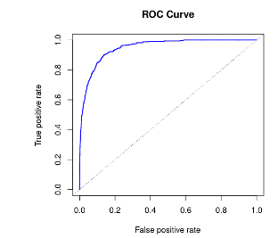
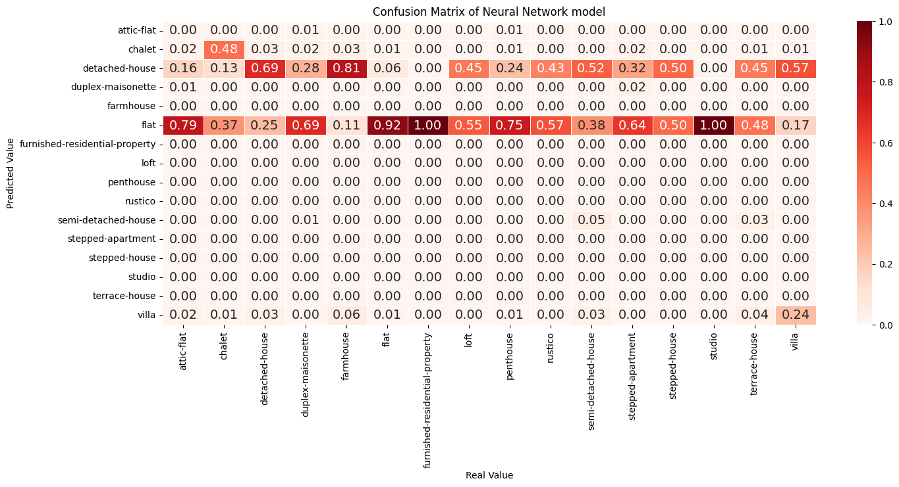
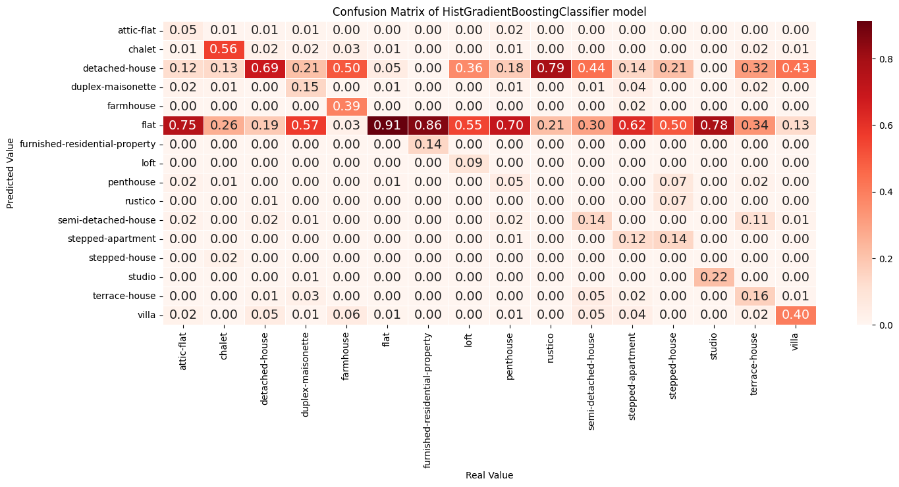

# classification-objecttype
Mit den Modellen in diesem Repository versuchen wir, anhand der uns gegebenen Informationen den Immobilientyp zu bestimmen.

# Metriken zur Bewertung eines Klassifikationsmodells

## Fehlerrate
Die Fehlerrate ist eine einfache und häufig verwendete Metrik zur Quantifizierung der Genauigkeit eines Klassifikationsmodells und wird berechnet, indem die Anzahl falsch klassifizierter Observationen durch die Anzahl aller Observationen geteilt wird:

$$  
\frac{1}{n}\sum_{i=1}^{n}I\left(y_i\neq\widehat{y_i}\right)  
$$

Wobei $I(y_i\neq\widehat{y_i})$ eine Dummy Variable ist, die den Wert $1$ annimmt, wenn die Bedingung erfüllt ist und $0$ wenn nicht.  
Angenommen es wird in einem Umfeld klassifiziert, in welchem nur eine sehr kleine Anzahl der Observationen von der Standardklasse abweichen, zum Beispiel 2%, dann würde die Fehlerrate beim Einsatz des einfachsten Modells, welches nur die Standardklasse (die am häufigsten vorkommende Klasse des Datensatzes) zuweist, sehr klein sein (2%). Aus diesem Grund wurden weitere Metriken definiert, welche alle die Konfusionsmatrix als Grundlage verwenden.

## Konfusionsmatrix
Eine Konfusionsmatrix erhält man, wenn auf einer Achse die echten Klassen und auf der anderen die durch ein Modell bestimmte (vorhergesagte) Klassen gezeigt werden:
|                      | POSITIV (ECHT)  | NEGATIV (ECHT)  |
| -------------------- | --------------- | --------------- | 
| POSITIV (VORHERSAGE) | Richtig Positiv | Falsch Negativ  |
| NEGATIV (VORHERSAGE) | Falsch Positiv  | Richtig Negativ |

In den Zellen dieser Tabelle können wir nun die folgenden Werte festhalten:
-	`Richtig Positiv (TP)`: Die Anzahl der korrekt als positiv klassifizierten Observationen
-   `Richtig Negativ (TN)`: Die Anzahl der korrekt als negativ klassifizierten Observationen
-	`Falsch Positiv (FP)`: Die Anzahl der falsch als positiv klassifizierten Observationen (auch Fehler 1. Art)
-	`Falsch negativ (FN)`: Die Anzahl der falsch als negativ klassifizierten Observationen (Fehler 2. Art)

Aus diesen Werten der Konfusionsmatrix können nun diverse Metriken berechnet werden, um die Performance eines Klassifikationsmodells genauer zu untersuchen.

## Recall
Der Recall wird wie folgt berechnet:

$$  
\frac{TP}{TP+FN}
$$  

und entspricht dem Verhältnis aller korrekt als positiv klassifizierte Observationen zu der Anzahl Observationen der Klasse positiv: Der Recall gibt an, wie viele der insgesamt positiven Instanzen richtig klassifiziert wurden.

## Precision
Die Precision wird wie folgt berechnet:

$$  
\frac{TP}{TP+FP}
$$  

und entspricht dem Verhältnis aller korrekt als positiv klassifizierte Observationen zu der Anzahl Observationen, welche vom Modell als positiv klassifiziert wurden: Es ist der Prozentsatz der Instanzen, die in die positive Klasse eingestuft werden, die tatsächlich richtig ist.

In der Praxis kommt es oft zu einem Kompromiss zwischen `Recall` und `Precision`: Wenn ein Klassifikationsmodell eine bessere `Precision` priorisiert, wirkt sich das negativ auf den `Recall` Wert aus und umgekehrt. Aus diesem Grund wird oft pro Anwendung definiert, welches Verhältnis im Vordergrund steht. 
Das Ziel der Klassifikationsmodells der cml1 Challenge ist es, den Objekttyp aufgrund von ausgewählten Inputvariablen zu bestimmen. Es spielt in diesem Fall keine grosse Rolle, welche Art von Fehler begangen wird. Wichtiger ist es, insgesamt zu bestimmen, wie viele Klassifikationen korrekt bestimmt wurden.

## F1 Score
Dazu könnte der `F1-Score` eingesetzt werden, denn dieser Kombiniert die `Precision` und den `Recall` wie folgt in einer Metrik:

$$  
\frac{TP}{TP+\frac{1}{2}\left(FP+FN\right)}
$$  

Dieser Wert gewichtet die `Precision` und den `Recall` gleich und fällt
- 	Hoch aus, wenn beide hoch sind
- 	Mittel aus, wenn z.B. `Recall` hoch, aber `Precision` klein ist
-  	Mittel aus, wenn z.B. `Precision` hoch, aber `Recall` klein ist
- 	Klein aus, wenn beide klein sind

## Accuracy
Die Genauigkeit wird berechnet durch:

$$  
\frac{TP+TN}{TP+TN+FP+FN}
$$  
 
Und entspricht der umgekehrten Fehlerrate. Sie unterliegt also denselben Problemen im Falle einer unbalancierten Klassifikation.

## Matthews Correlation Coefficient (MCC)
Der Matthews Correlation Coefficient fasst die komplette Konfusionsmatrix in einer Metrik zusammen:

$$  
MCC=\frac{TN\times T P-FP\times F N}{\sqrt{\left(TN+FN\right)\left(FP+TP\right)\left(TN+FP\right)\left(FN+TP\right)}}
$$  

Wie jeder Korrelationskoeffizient nimmt er Werte zwischen $-1$ und $1$ an und berücksichtigt auch richtig negative (`TN`) Klassifikationen, welche vom `F1-Score` nicht berücksichtigt werden. Der `MCC` wird demnach nur hoch, wenn das Klassifikationsmodell richtig positiv und negativ klassifiziert. 

## Averaging
Bisher wurde nur der Fall dargestellt, in welchem zwei Klassen für das Klassifikationsmodell zur Auswahl vorhanden sind. In dem Fall der Objektklassifikation von Immobilien stehen $n\ >\ 2$ Klassen zur Auswahl.
Das Konzept der Konfusionsmatrix kann ohne weiteres auf mehrere Dimensionen ausgeweitet werden. Die Werte (`TP`, `TN`, `FP`, `FN`) werden weiterhin aber pro Klasse berechnet. Wird dann eine Metrik wie der `F1-Score` berechnet, erhält man $n$-Werte. 

### Micro Averaging
Micro Averaging ist eine Möglichkeit, $n$-Werte einer Metrik in eine zusammenzufassen. Dazu werden alle Werte der Konfusionsmatrix klassenunabhängig aufsummiert. Beispiel `TP`:

$$  
TP=\sum_{i=1}^{n}{TP_n}
$$  

Werden die zuvor beschriebenen Metriken nun mit diesen Werten berechnet, fallen sie alle gleich aus:

$$  
\mathrm{Recall}=\mathrm{Precision}=\mathrm{F1}=\mathrm{Accuracy}
$$  

### Macro Averaging

Eine Alternative dazu ist das Macro Averaging. Hier werden die Werte der Konfusionsmatrix pro Klasse verwendet, um die Metriken zu berechnen und anschliessend wird das arithmetische Mittel von allen berechnet:

$$  
F1= 	\frac{\sum\limits^{n}_{i=1} F1_i}{n}
$$  

### Weighted Averaging
Um den stärker repräsentierten Klassen eine entsprechend höhere Gewichtung zu geben, kann das Macro Averaging mit dem gewichteten Mittel erweitert werden:

$$  
F1= \frac{\sum\limits^{n}_{i=1}{F1_i} \cdot r_i}{\sum\limits^{n}_{i=1}r_i}
$$  

Wobei $r_i$ der Anzahl Observationen in der $i$-ten Klasse entspricht. 

## ROC-Curve
Die Precision kann durch Anpassung der Entscheidungsschwelle, welche normalerweise bei $0.5$ liegt, erhöht werden. Wie bereits erwähnt wirkt sich das in der Regel direkt negativ auf den `Recall` aus. Diese Beziehung kann mit einer `ROC` (Receiver Operating Characteristic) Kurve dargestellt werden. Dazu wird das Verhältnis zwischen den falsch positiven und richtig positiven Klassifikationen zu allen möglichen Schwellwerten dargestellt:  

Idealerweise sieht die Kurve aus wie in diesem Beispiel: Sie nähert sich an die obere, linke Ecke an. Das bedeutet, dass das Verhältnis von richtig positiven Klassifikationen hoch ist im Verhältnis zu den falsch positiven Klassifikationen. 

### ROC AUC
Dieses Verhältnis kann durch die Fläche unterhalb der ROC-Kurve quantifiziert werden und wird `ROC AUC Score` genannt. Ein grösserer `ROC AUC`-Wert entspricht einem besseren Klassifikationsmodell und kann auch bei unbalancierter Verteilung der Klassen verwendet werden. 

# Relevante Metriken (Diskussion)
Für die Klassifikation des Objekttyps von Immobilien gewichten wir weder die `Precision` noch den `Recall` höher, weshalb wir uns aus diesbezüglich ausgeglichene Metriken beschränken. Zudem sind die Klassen stark ungleichmässig verteilt, weshalb die `Accuracy` keine robuste Metrik ist. Wir haben uns deshalb entschieden, den `F1-Score`, den `MCC` und `ROC AUC` der eingesetzten Modelle zu vergleichen. Wir setzen jeweils den gewichteten Mittelwert dieser Werte ein. 

# Vergleich der Modelle
Um klar identifizieren zu können, welches Modell wie gut performt, wird oft zunächst ein Null-Modell aufgestellt, welches als Klassifizierung einfach die Klasse angibt, welche am meisten vorkommt. Dieses Modell erzielt mit den hier eingesetzten Metriken jedoch keine brauchbaren Resultate, weshalb wir darauf verzichten.

| Modell                         | Accuracy | F1 weighted | F1 micro | F1 macro | MCC  | AUC  |
| ------------------------------ | -------- | ----------- | -------- | -------- | ---- | ---- |
| Neural Network                 | 0.65     | 0.56        | 0.63     | 0.15     | 0.43 | 0.7  |
| KNeigboursClassifier           | 0.59     | 0.52        | 0.6      | 0.29     | 0.29 | 0.57 |
| Random Forest Classifier       | 0.66     | 0.59        | 0.62     | 0.28     | 0.38 | 0.56 |
| HistGradientBoostingClassifier | 0.68     | 0.61        | 0.67     | 0.3      | 0.4  | 0.56 |

## Schlussfolgerung
Das Neuronale Netzwerk ist sehr biased aufgrund der vielen "flat" Einträge und deswegen fällt der F1 macro dementsprechend tief aus.  
Man sieht es in der Confusion Matrix wo die Diagonaleinträge mehr oder weniger
nicht vorhanden sind:

Hier ist es aber wichtig, den Use-Case miteinzuberechnen. Das Neuronale Netzwerk klassifiziert am besten, wenn man den AUC Score verwenden will. Jedoch führt das dazu, dass die meisten Datensätze als "flat" oder "detached House" klassifiziert werden. Das Modell sagt nur selten andere Klassen vor. 

Falls man jedoch will, dass die anderen Klassen auf Kosten von "flat" und "detached House" öfters vorgeschlagen werden, nehmen wir das Modell mit dem besten F1 macro score: HistGradientBoostingClassifier. Der HistGradientBoostingClassifier hat auch die beste Accuracy von allen Modellen. Hier sieht die Confusion Matrix dieses Modells:

Ohne genaueren Kontext oder Anwendungsfall können wir keine Empfehlung machen, welches Modell das bessere ist. In den meisten Fällen können wir aber eher das HistGradientBoostingClassifier Modell empfehlen.

## Abschätzung des Fehlers für neue Daten
Um eine akkurate Abschätzung des Fehlers zu erhalten, teilt man die Daten in Trainings- und Validierungsdaten. Mit den Trainingsdaten wird das Modell gefittet. Da das Modell die Validierungsdaten nicht kennt, sind es neue Daten für das Modell. 

Da wir in einigen Klassen mehr Datensätze als in andere haben, splitten wir die Daten mit Stratifying in Trainings- und Validierungsdaten, damit die Verteilung der Klassen in beiden Datensätzen ähnlich ist. Somit können wir eine akkurate Fehlerabschätzung für jede Klasse erstellen.

Man muss beachten, dass die Trainings-, Validierungs- und die produktiven Testdaten auf die gleiche Art verarbeitet werden müssen, damit das Modell akkurate Vorhersagen machen kann.