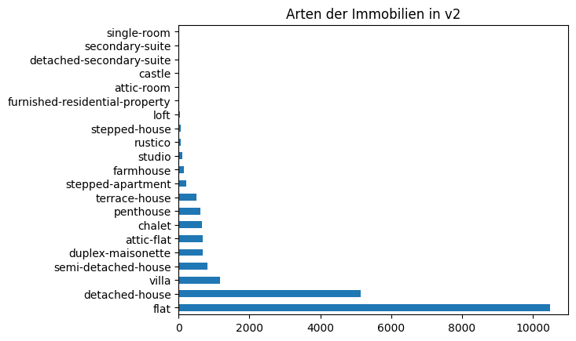
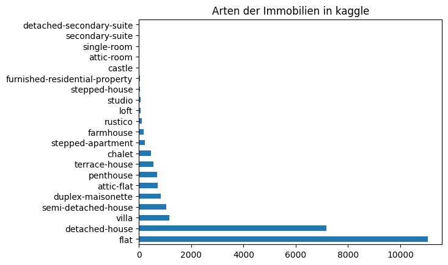

# Exploratory Data Analysis
## Einleitung
Das Repository `explorative-data-analysis` wurde erstellt, um einen klaren Überblick über die in dieser Challenge zur Verfügung gestellten Daten zu erhalten und um einen Weg zu finden, die vorhandenen Daten soweit wie möglich zu konsolidieren und zu säubern.  
Im Verlauf der Challenge wurden uns drei Datensätze bereitgestellt:
- Eine erste Version, in diesem Projekt abgespeichert als `data/immo_data_202208.csv`
- Eine zweite Version, in diesem Projekt abgespeichert als `data/immo_data_202208_v2.parquet`
- Ein _kaggle_-Datensatz, in diesem Projekt abgespeichert als `data/kaggle_uncleqned.parquet`

Die erste Version basiert auf Daten, welche von immoscout24.ch extrahiert wurden. Zusätzlich wurden Daten vom Bundesamt für Statistik und weiteren Quellen zu den vorhandenen Einträgen dazugelesen. In der zweiten Version des Datensatzes sind Daten basierend auf Extraktionen von homegate.ch hinzugefügt worden. Der kaggle-Datensatz ist wie die Version 2 basierend auf einem Mix von immoscout24.ch und homegate.ch, sowie den zusätzlich gelesenen Attributen.  

Dieser Bericht beschreibt nachfolgend die von den 4 Wrangeleers (Si Ben Tran, Gabriel Torres Gamez, Haris Alic, Alexander Shanmugam) eingesetzte Methodik, um das zuvor beschriebene Ziel zu erreichen und die dabei gefunden Erkenntnisse, sowie die Verwendung des erstellten Quellcodes.  
Es ist nicht trivial, einen tiefen und nützlichen Überblick von grossen Datensets zu erhalten und um diesen Prozess übersichtlich und strukturiert zu gestalten, haben wir spaltenbasierte und zeilenbasierte Aktionen grösstenteils separiert. 

## Spaltenbasierte Analyse
Im Verzeichnis `dataWrangling` des `explorative-data-analysis` Repositories wurde Quellcode erstellt, um eine Einsicht über die zur Verfügung gestellten Spalten zu erhalten. Die drei verschiedenen Datensätze, welche uns im Verlauf der Challenge bereitgestellt wurden, sind bezüglich ihrer Spalten alle miteinander verwandt.  
Der erste Datensatz (`data/immo_data_202208.csv`) beinhaltet mit 108 die kleinste Anzahl von Spalten. Sämtliche in der ersten Version enthaltenen Spalten finden sich in der zweiten Version (`data/immo_data_202208_v2.parquet`) wieder zusammen mit 26 neuen Spalten, was eine Gesamtanzahl von 134 ergibt. Die dritte (kaggle) Version der Daten enthält alle Spalten der Version zwei, ausser vier.  

Die Rohdaten befinden sich zu diesem Zeitpunkt nicht im _tidy-Format_, hauptsächlich weil nicht jede Spalte Daten zu genau einem Merkmal in einem durchgehenden Format beinhaltet. Die nachfolgende Tabelle zeigt auf, welche Merkmale aus welchen Spalten extrahiert werden können.  

| Merkmal | zu finden in Spalten der Version 1 | zu finden in Spalten der Version 2 | zu finden in Spalten der kaggle Version |  
| ------- | ---------------------------------- | ---------------------------------- | --------------------------------------- |
| Verfügbarkeit | `Availability`, `Availability_merged`, `Disponibilità`, `Disponibilité`, `Verfügbarkeit`, `detail_responsive#available_from` | `Availability`, `Availability_merged`, `Disponibilità`, `Disponibilité`, `Verfügbarkeit`, `detail_responsive#available_from` | `Availability`, `Availability_merged`, `Disponibilità`, `Disponibilité`, `Verfügbarkeit`, `detail_responsive#available_from` |
| Adresse | `Commune`, `Comune`, `Gemeinde`, `Municipality`, `Municipality_merged`, `detail_responvice#municipality`, `address`, `Locality`, `location`, `location_parsed`, `table`, `details_structured`, `zip` | `Commune`, `Comune`, `Gemeinde`, `Municipality`, `Municipality_merged`, `detail_responvice#municipality`, `address`, `address_s`, `Locality`, `location`, `location_parsed`, `table`, `details_structured`, `zip`, `plz`, `plz_parsed` | `Commune`, `Comune`, `Gemeinde`, `Municipality`, `Municipality_merged`, `detail_responvice#municipality`, `address`, `address_s`, `Locality`, `location`, `location_parsed`, `table`, `details_structured`, `zip`, `plz`, `plz_parsed` |
| Koordinaten | `Latitude`, `lat`, `Longitude`, `lon` | `Latitude`, `lat`, `Longitude`, `lon` | `Latitude`, `lat`, `Longitude`, `lon` |
| Stockwerk | `Floor`, `Floor_merged`, `Piano`, `Stockwerk`, `Étage`, `detail_responsive#floor`, `table`, `details_structured` | `Floor`, `Floor_merged`, `Piano`, `Stockwerk`, `Étage`, `detail_responsive#floor`, `table`, `details_structured`, `Floor_unified` | `Floor`, `Floor_merged`, `Piano`, `Stockwerk`, `Étage`, `detail_responsive#floor`, `table`, `details_structured`, `Floor_unified` |
| Nutzfläche | `Floor space`, `Floor_space_merged`, `Nutzfläche`, `Superficie utile`, `Surface utile`, `detail_responsive#surface_usable`, `table`, `details_structured` | `Floor space`, `Floor_space_merged`, `Nutzfläche`, `Superficie utile`, `Surface utile`, `detail_responsive#surface_usable`, `table`, `details_structured`, `Minimum floor space` | `Floor space`, `Floor_space_merged`, `Nutzfläche`, `Superficie utile`, `Surface utile`, `detail_responsive#surface_usable`, `table`, `details_structured`, `Minimum floor space` |
| Grundstücksfläche | `Grundstücksfläche`, `Plot area`, `Plot_area_merged`, `Superficie del terreno`, `Surface de terrain`, `detail_responsive#surface_property`, `table`, `details_structured` | `Grundstücksfläche`, `Plot area`, `Plot_area_merged`, `Superficie del terreno`, `Surface de terrain`, `detail_responsive#surface_property`, `table`, `details_structured`, `Land area:`, `Plot_area_unified` | `Grundstücksfläche`, `Plot area`, `Plot_area_merged`, `Superficie del terreno`, `Surface de terrain`, `detail_responsive#surface_property`, `table`, `details_structured`, `Land area:`, `Plot_area_unified` |
| Wohnfläche | `Living space`, `Living_space_merged`, `Superficie abitabile`, `Surface habitable`, `Wohnfläche`, `detail_responsive#surface_living`, `description`, `table`, `details_structured` | `Living space`, `Living_space_merged`, `Superficie abitabile`, `Surface habitable`, `Wohnfläche`, `detail_responsive#surface_living`, `description`, `table`, `details_structured`, `Living_area_unified`, `Surface living:` | `Living space`, `Living_space_merged`, `Superficie abitabile`, `Surface habitable`, `Wohnfläche`, `detail_responsive#surface_living`, `description`, `table`, `details_structured`, `Living_area_unified`, `Surface living:` |
| Bruttorendite | `Gross return`, `table`, `details_structured` | `Gross return`, `table`, `details_structured`, `Gross yield` | `Gross return`, `table`, `details_structured`, `Gross yield` |
| Umweltfaktoren | `NoisePollutionRailwayL`, `NoisePollutionRailwayM`, `NoisePollutionRailwayS`, `NoisePollutionRoadL`, `NoisePollutionRoadM`, `NoisePollutionRoadS`, `PopulationDensityL`, `PopulationDensityM`, `PopulationDensityS`, `RiversAndLakesL`, `RiversAndLakesM`, `RiversAndLakesS`, `ForestDensityL`, `ForestDensityM`, `ForestDensityS`, `WorkplaceDensityL`, `WorkplaceDensityM`, `WorkplaceDensityS`, `distanceToTrainStation` | `NoisePollutionRailwayL`, `NoisePollutionRailwayM`, `NoisePollutionRailwayS`, `NoisePollutionRoadL`, `NoisePollutionRoadM`, `NoisePollutionRoadS`, `PopulationDensityL`, `PopulationDensityM`, `PopulationDensityS`, `RiversAndLakesL`, `RiversAndLakesM`, `RiversAndLakesS`, `ForestDensityL`, `ForestDensityM`, `ForestDensityS`, `WorkplaceDensityL`, `WorkplaceDensityM`, `WorkplaceDensityS`, `distanceToTrainStation` | `NoisePollutionRailwayL`, `NoisePollutionRailwayM`, `NoisePollutionRailwayS`, `NoisePollutionRoadL`, `NoisePollutionRoadM`, `NoisePollutionRoadS`, `PopulationDensityL`, `PopulationDensityM`, `PopulationDensityS`, `RiversAndLakesL`, `RiversAndLakesM`, `RiversAndLakesS`, `ForestDensityL`, `ForestDensityM`, `ForestDensityS`, `WorkplaceDensityL`, `WorkplaceDensityM`, `WorkplaceDensityS`, `distanceToTrainStation` |
| Gemeindemerkmale | `gde_area_agriculture_percentage`, `gde_area_forest_percentage`, `gde_area_nonproductive_percentage`, `gde_area_settlement_percentage`, `gde_average_house_hold`, `gde_empty_apartments`, `gde_foreigners_percentage`, `gde_new_homes_per_1000`, `gde_politics_bdp`, `gde_politics_cvp`, `gde_politics_evp`, `gde_politics_fdp`, `gde_politics_glp`, `gde_politics_gps`, `gde_politics_pda`, `gde_politics_rights`, `gde_politics_sp`, `gde_politics_svp`, `gde_pop_per_km2`, `gde_population`, `gde_private_apartments`, `gde_social_help_quota`, `gde_tax`, `gde_workers_sector1`, `gde_workers_sector2`, `gde_workers_sector3`, `gde_workers_total` | `gde_area_agriculture_percentage`, `gde_area_forest_percentage`, `gde_area_nonproductive_percentage`, `gde_area_settlement_percentage`, `gde_average_house_hold`, `gde_empty_apartments`, `gde_foreigners_percentage`, `gde_new_homes_per_1000`, `gde_politics_bdp`, `gde_politics_cvp`, `gde_politics_evp`, `gde_politics_fdp`, `gde_politics_glp`, `gde_politics_gps`, `gde_politics_pda`, `gde_politics_rights`, `gde_politics_sp`, `gde_politics_svp`, `gde_pop_per_km2`, `gde_population`, `gde_private_apartments`, `gde_social_help_quota`, `gde_tax`, `gde_workers_sector1`, `gde_workers_sector2`, `gde_workers_sector3`, `gde_workers_total` | `gde_area_agriculture_percentage`, `gde_area_forest_percentage`, `gde_area_nonproductive_percentage`, `gde_area_settlement_percentage`, `gde_average_house_hold`, `gde_empty_apartments`, `gde_foreigners_percentage`, `gde_new_homes_per_1000`, `gde_politics_bdp`, `gde_politics_cvp`, `gde_politics_evp`, `gde_politics_fdp`, `gde_politics_glp`, `gde_politics_gps`, `gde_politics_pda`, `gde_politics_rights`, `gde_politics_sp`, `gde_politics_svp`, `gde_pop_per_km2`, `gde_population`, `gde_private_apartments`, `gde_social_help_quota`, `gde_tax`, `gde_workers_sector1`, `gde_workers_sector2`, `gde_workers_sector3`, `gde_workers_total` |
| Preis | `price`, `price_cleaned`, `details_structured` | `price`, `price_cleaned`, `details_structured`, `price_s` | `price`, `price_cleaned`, `details_structured`, `price_s` |
| Anzahl Zimmer | `rooms`, `description`, `details_structured` | `rooms`, `description`, `details_structured`, `No. of rooms:` | `rooms`, `description`, `details_structured`, `No. of rooms:` |
| Art | `type` | `type`, `type_unified` | `type_unified` |
| Features | - | `features` | `features` |
| Volumen | - | `Volume:` | `Volume:` |
| Raumhöhe | - | `Room height:` | `Room height:` |
| Anzahl Toiletten | - | `Number of toilets:` | `Number of toilets:` |
| Anzahl Stockwerke | - | `Number of floors:` | `Number of floors:` |
| Anzahl Wohnungen | - | `Number of apartments:` | `Number of apartments:` |
| Letzte Sanierung | - | `Last refurbishment:` | `Last refurbishment:` |
| Baujahr | - | `Year built:` | `Year built:` |

Die Herleitung dieser Tabelle ist in den folgenden Jupyter Notebooks beschrieben: `dataWrangling/v1/1-daw-columns.ipynb`, `dataWrangling/v2/1-daw-columns.ipynb` und `dataWrangling/kaggle/daw.ipynb`. Zu beachten ist, dass es sich bei den Tabelleneinträgen _Adresse_, _Umweltfaktoren_ und _Gemeindemerkmale_ jeweils um einen Überbegriff mehrerer, einzelner Merkmale handelt. Diese Zusammenfassung wurde Zwecks Übersichtlichkeit und Lesbarkeit vorgenommen.  

### Extraktion und Konsolidierung der Merkmale
Es ist klar zu erkennen, dass einige Merkmale in mehreren Spalten vorkommen. Die restlichen Notebooks im `dataWrangling` Verzeichnis widmen sich der Extraktion der pro Merkmal relevanten Daten aus den jeweiligen Spalten. Nachfolgend beschreiben wir, wie wir die Merkmale schlussendlich extrahiert haben.

#### Verfügbarkeit
In unserer Analyse haben wir herausgefunden, dass die Spalte `Availability_merged` zusammengefügt mit den Daten in der Spalte `detail_responsive#available_from` für alle Versionen der Daten die höchste Anzahl von Observationen in einem durchgehenden Format liefert. 

#### Adresse
Die Adresse einer Immobilie kann jeweils weiter aufgeteilt werden in die Gemeinde, Strasse, Strassennummer und die Postleitzahl, sowie den dazugehörigen Kanton. Für die erste Version der Daten lesen wir alle diese Informationen aus der Spalte `address` mit entsprechenden regulären Ausdrücken.  

In Version zwei der Daten lesen wir die benötigten Informationen zusätzlich von der Spalte `address_s`, welche neu dazu gekommen ist und fügen die Resultate zusammen. Anders als in Version eins wird einfachheitshalber nun der Kanton von einer externen Ressource dazugelesen.  

Die kaggle-Version der Daten liefert zuvor ungesehende Muster in den Daten, weshalb der Reguläre Ausdruck für die Postleitzahl leicht angepasst werden muss. Ansonsten können die Adressdaten gleich wie in Version zwei extrahiert werden. 

#### Koordinaten
Die Koordinaten werden für alle Versionen aus den Spalten `Longitude` und `Latitude` gelesen.

#### Stockwerk
Auf welchem Stockwerk sich eine Immobilie befindet (falls zutreffend) wird in Version eins von den Spalten `Floor_merged` und `detail_responsive#floor` gelesen.  

In Version zwei und kaggle kommt eine neue Spalte `Floor` hinzu, welche als Grundlage verwendet wird. Fehlende Werte werden dann mit der selben Extraktion wie zuvor gefüllt. 

#### Nutzfläche
Die Nutzfläche einer Immobilie extrahieren wir für die Version eins mit entsprechenden regulären Ausdrücken aus den Spalten `Floor_space_merged` und `detail_responsive#surface_usable`.  

In Version zwei und kaggle kommt eine neue Spalte hinzu: `Floor space:`. Diese wird genutzt, um Lücken, die mit der Methode aus Version eins entstehen, zu füllen. 

#### Grundstücksfläche
Ähnlich wie die Nutzfläche wird in Version eins der Daten die Grundstücksfläche aus den Spalten `Plot_area_merged` und `detail_responsive#surface_property` gelesen.  

Die Versionen zwei und kaggle beinhalten zudem die Spalte `Land area:`, welche genutzt wird, um Lücken der bisherigen Methode zu füllen.

#### Wohnfläche
Anders als bei zuvor betrachtete Flächen, finden wir die grösste Menge an Daten für die Wohnfläche in einer Spalte namens `Space extracted` für die Version 1 der Daten.  
 
In der zweiten Version der Daten wird die Spalte `Living_area_unified` beigefügt, welche die selben Informationen wie `Space extracted` beinhaltet. Daher können beide Spalten genutzt werden. In der kaggle Version der Daten beinhaltet aber weder `Living_area_unified` noch `Space extracted` den vollen Datensatz, weshalb fehlende Werte der einen Spalte mit den Daten der anderen Spalte gefüllt werden. 

#### Bruttorendite
Die Bruttorendite ist in allen Versionen nur sehr spährlich gefüllt, weshalb wir dieses Merkmal für unsere Modellierung ausschliessen. 

#### Umweltfaktoren
Die folgenden Umweltfaktoren sind in drei Messgrössen (S, M, und L) vorhanden: 
- Lärmbelastung durch die Eisenbahn: `NoisePollutionRailwayL`, `NoisePollutionRailwayM`, `NoisePollutionRailwayS`
- Lärmbelastung durch die Strasse: `NoisePollutionRoadL`, `NoisePollutionRoadM`, `NoisePollutionRoadS`
- Bevölkerungsdichte: `PopulationDensityL`, `PopulationDensityM`, `PopulationDensityS`
- Flüsse und Seen: `RiversAndLakesL`, `RiversAndLakesM`, `RiversAndLakesS`
- Walddichte:  `ForestDensityL`, `ForestDensityM`, `ForestDensityS` und 
- Arbeitsplatzdichte: `WorkplaceDensityL`, `WorkplaceDensityM`, `WorkplaceDensityS`

Zudem finden wir die Information der Distanz zum nächsten Bahnhof in der Spalte `distanceToTrainStation`.

#### Gemeindemerkmale
Diese Merkmale wurden bisher ebenfalls zusammengefasst. Sie stammen alle von der selben Quelle und beziehen sich auf die Gemeinde:
- prozentualer Anteil an landwirtschaftlicher Fläche: `gde_area_agriculture_percentage`
- prozentualer Anteil an Waldfläche: `gde_area_forest_percentage`
- prozentualer Anteil an nicht nutzbarem Gelände: `gde_area_nonproductive_percentage`
- prozentualer Anteil an Siedlungsgebiet: `gde_area_settlement_percentage`
- Durchschnittliche Grösse eines Haushalts: `gde_average_house_hold`
- Leerstehende Wohnungen: `gde_empty_apartments`
- prozentualer Ausländeranteil: `gde_foreigners_percentage`
- Anzahl Neubauten pro 1000: `gde_new_homes_per_1000`
- Politische Landschaft: `gde_politics_bdp`, `gde_politics_cvp`, `gde_politics_evp`, `gde_politics_fdp`, `gde_politics_glp`, `gde_politics_gps`, `gde_politics_pda`, `gde_politics_rights`, `gde_politics_sp`, `gde_politics_svp`
- Bevölkerungsdichte: `gde_pop_per_km2`, `gde_population`
- Privatwohnungen: `gde_private_apartments`
- Quota für soziale Hilfe: `gde_social_help_quota`
- Gemeindesteuer: `gde_tax`
- Arbeiter pro Sektor und gesamt: `gde_workers_sector1`, `gde_workers_sector2`, `gde_workers_sector3`, `gde_workers_total` 

#### Preis
Der Preis einer Immobilie wird in der Version eins und zwei der Daten bequem in der Spalte `price_cleaned` gefunden.  

In der kaggle Version fehlt die Preisinformation, da diese durch unser bestes Modell geschätzt werden soll.

#### Anzahl Zimmer
In Version eins kann die grösste Menge an Informationen zur Anzahl Zimmer einer Immobilie aus der Spalte `details_structured` extrahiert werden.  

Wo Informationen in dieser Spalte der Version zwei nicht vorhanden sind, können zusätzliche Daten aus `No. of rooms:` gelesen werden. Das selbe Vorgehen wird auch für den kaggle Datensatz angewendet.

#### Art
Die Art einer Immobilie ist in der Spalte `type` der Version eins verfügbar. In Version zwei werden Daten aus homegate.ch dazugelesen, wo die Art der Immobilie anders beschrieben und kategorisiert wird. Diese neuen Arten wurden auf die bisher bekannten Arten von immoscout24.ch zugeordnet und in der Spalte `type_unified` abgelegt. In der kaggle Version der Daten steht nur noch diese neue Spalte zur Verfügung. 

#### Restliche Merkmale
Die folgenden restlichen Merkmalen tauchen nur ab Version zwei und in einer Spalte auf und können deshalb direkt so übernommen werden:
- Features
- Volumen
- Raumhöhe
- Anzahl Toiletten
- AnzahlStockwerke
- Anzahl Wohnungen
- Letzte Sanierung
- Baujahr

## Zeilenbasierte Analyse
Im Rahmen der vorgenommenen Analysen sind wir auf diverse Zeilen gestossen, welche unvollständige oder falsche Daten beinhalten. 

### Version 1
Die Version eins der Daten beinhaltet eine Observation einer Immobilie, welche sich in Frankreich befindet. Diese Immobilie hat den Index 3874 und da alle anderen Immobilien sich in der Schweiz befinden und das Land und deren Währung einen grossen Einfluss auf den Wert einer Immobilie hat, haben wir uns entschieden, diesen Eintrag zu entfernen.  

Des weiteren gibt es Observationen mit unwahrscheinlichen Ausprägungen von Merkmalen wie einem sehr niedrigen Preis, sehr grossen Grundstücksflächen und Nutzflächen oder Immobilien in einem unwahrscheinlich hohen Stockwerk. Einträge mit solchen Ausprägungen ignorieren wir, um die Genauigkeit unserer Modelle zu erhöhen.

### Version 2
Auch in der Version zwei der Daten finden wir die selben Vorkommnisse wie bereits in der Version eins, also eine Observation aus Frankreich und unwahrscheinlich grosse oder kleine Ausprägungen von Merkmalen. Zudem haben wir Postleitzahlen gefunden, welche vermutlich von den Benutzern falsch eingetragen worden sind, denn diese Postleitzahlen konnten wir nicht validieren. Mit einer kurzen manuellen Überprüfung der Gemeinde konnten wir die korrekten Postleitzahlen ausfindig machen.

### Kaggle
Aus dem Kaggle Datensatz können wir keine unwahrscheinlichen Observationen entfernen, da von dem Wettbewerb ein Datensatz mit Preisschätzungen für jede Zeile in dem zur Verfügung gestellten Datensatz verlangt wird. Falsch geschriebene Postleitzahlen kommen aber auch im Datensatz vor und diese korrigieren wir. Zudem gibt es ein Eintrag mit fehlender Gemeinde, diese konnten wir identifizieren und füllen. 

## Explorative Daten Analyse
Ein kompletter Bericht über die Zusammensetzung der Daten kann pro Version im Verzeichnis `eda` eingesehen werden. Nachfolgend haben wir die für uns wichtigsten Erkenntnisse daraus festgehalten. 

### Version 1
Die Version eins der Daten hat im unbehandelten Zustand 108 Spalten und 13378 Zeilen. Nach der Bereinigung haben wir ein Datensatz mit 61 Spalten und 12338 Zeilen. Dabei sind sämtliche Umweltfaktoren, Koordinaten, Kantone, Gemeinden, Postleitzahlen, Arten und Gemeindemerkmale ausser der politischen Landschaft zu 100% gefüllt. Eine Für die Klassifizierung relevante Eigenschaft der Daten ist die ungleichmässige Verteilung der Arten von Immobilien: 
  
Mit Abstand die meisten Immobilien sind Wohnungen, gefolgt von freistehenden Häusern. Alle anderen Kategorien sind zu weniger als 10% vertreten.  

Sehr schlecht ausgeprägt ist das Merkmal Strasse (32%) und Strassennummer (21%), Nutzfläche (22%), Grundstücksfläche (36%) und Stockwerk(43%).  

<!-- Sehr schiefe Verteilung, Bild einfügen und evtl noch obere Ausreiser entfernen? -->
Der durchschnittliche Preis einer Immobilie im Datensatz liegt bei CHF 1.2 Millionen mit einer Standardabweichung von CHF 1.3 Millionen, wobei die teuerste Immobilie CHF 45.0 Millionen kostet. Der Median liegt bei CHF 0.9 Millionen. 

### Version 2
Die zweite Version der Daten hat im rohen Zustand 134 Spalten und 22481 Zeilen. Nach der Bereinigung hat der Datensatz noch 64 Spalten und 21412 Zeilen. Die Merkmale der Umweltfaktoren, Koordinaten, Kanton, Gemeinde, Postleitzahlen, Art und Gemeindemerkmale ausser der politischen Landschaft sind nach wie vor zu 100% gefüllt und die Verteilung der Arten von Immobilien ist nach wie vor sehr ungleichmässig:
  

Die Merkmale letzte Sanierung (10%), Strasse (19%) und Strassennummer (12%), Stockwerk (25%), Nutzfläche (26%), Baujahr (32%), Grundstücksfläche (36%) und features (39%) sind die am wenigsten gefüllten Merkmale.  

Der durchschnittliche Preis einer Immobilie im Datensatz liegt bei CHF 1.3 Millionen mit einer Standardabweichung von CHF 1.7 Millionen, wobei die teuerste Immobilie CHF 45.0 Millionen kostet. Der Median liegt noch immer bei CHF 0.9 Millionen. 

### Kaggle
Die kaggle Version der Daten hat unverändert 132 Spalten und 24556 Zeilen. Die Anzahl Zeilen dürfen wir nicht verändern, aber die Spalten reduzieren wir auf 64. Auch hier sind die Merkmale der Umweltfaktoren, Koordinaten, Kanton, Gemeinde, Postleitzahlen und Gemeindemerkmale ausser der politischen Landschaft sind nach wie vor zu 100% gefüllt und die Verteilung der Arten von Immobilien ist nach wie vor sehr ungleichmässig:
  
112 Observationen besitzen aber keine Art der Immobilie.  

Die Merkmale letzte Sanierung (12%), Nutzfläche (21%), Stockwerk (22%), Strasse (34%) und Strassennummer (22%), Grundstücksfläche (36%), Baujahr (38%) und features (43%) sind die am wenigsten gefüllten Merkmale.  

Der Preis ist nicht vorhanden.

## Verwendung
Sämtliche Notebooks im Verzeichnis `dataWrangling` können ohne Nebeneffekte ausgeführt werden. Sie liefern eine ausführliche Begründung für die weiter oben beschriebene Konsolidierung der Spalten. Für Version eins und zwei der Daten haben wir jeweils vier Notebooks erstellt. Das erste bietet eine Übersicht über die vorhandenen Spalten. In dem zweiten Notebook explorieren wir, welche Daten in Spalten wie `table` und `details` enthalten und extrahierbar sind. Das dritte Notebook behandelt dann jeweils sämtliche numerischen Merkmale und das vierte und letzte Notebook die qualitativen Merkmale.  
Da der kaggle Datensatz der Version zwei sehr stark ähnelt haben wir nur eine verkürzte Begrüngung erstellt. 

Im Verzeichnis `eda` befinden sich Notebooks und Skripts. Die unter `eda/utils` befindlichen `.py`-Dateien beinhalten jeweils Funktionen, welche die Daten gemäss der unter `dataWrangling` beschriebenen Analyse konsolidieren. Die Notebooks lesen die Daten zunächst ein und wenden anschliessend diese Funktionen auf die eingelesenen Daten an. Danach wird einen SweetViz-Report erstellt, welcher direkt im Notebook eingesehen werden kann. Er beinhaltet wertvolle Statistiken und Visualisierungen zu den bisher bearbeiteten Daten. Mit Hilfe von diesen Reports können noch bestehende Unschönheiten der Daten gefunden werden. Die so von uns gefundenen Probleme wurden jeweils in der Funktion `clean_rows()` festgehalten. Die letzten Zeilen und Zellen der Notebooks wenden diese Funktion dann auf die Daten an und speichern das Resultat im `data` Verzeichnis. 

