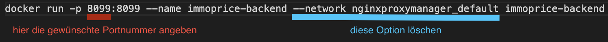
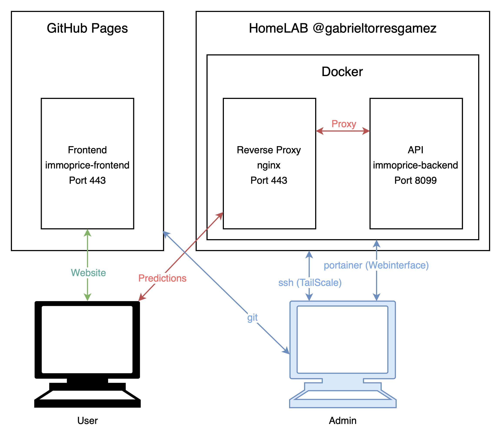

#repositories 
# immoprice-backend
Dieses Backend wurde mit basiert auf Django v4.1.3. Dependencies werden [hier](https://github.com/Immobilienrechner-Challenge/immoprice-backend/blob/main/requirements.txt) aufgelistet.
## Setup
Um die API auf einer Docker Umgebung zu nutzen, muss man die vorgefertigte Datei [create_docker_container.sh](https://github.com/Immobilienrechner-Challenge/immoprice-backend/blob/main/create_docker_container.sh) starten und den Container Port 8099 anhand einem nginx Reverse Proxy freigeben. 
### Setup ohne Reverse Proxy
Falls man die API nicht hinter ein nginx Reverse Proxy laufen lassen will, müsste man die Netzwerkeinstellungen in der [create_docker_container.sh](https://github.com/Immobilienrechner-Challenge/immoprice-backend/blob/main/create_docker_container.sh) Datei anpassen:

## Hosting
Das Hosting des Backends findet auf einer Docker Umgebung statt. Alle anfragen werden durch den Reverse Proxy auf [https://api.immoprice.ch](https://api.immoprice.ch) auf das Backend weitergeleitet. 

## Schnittstellen
Hier werden die relevanten Schnittstellen erfasst:
| URL                                         | Request Type | Beschreibung                             | Inputs                                                                                                                                                       | Output       | Beispiel                                                                                                                                                          |
|:------------------------------------------- |:------------ |:---------------------------------------- |:------------------------------------------------------------------------------------------------------------------------------------------------------------ |:------------ | ----------------------------------------------------------------------------------------------------------------------------------------------------------------- |
| [model1/](https://api.immoprice.ch/model1/) | GET          | Modell zur Vorhersage von Immobilienpreisen auf [immoprice.ch](https://immoprice.ch) | living_space(float)   type(string)  rooms(float)  zip_code(int)   floor_space(float)   plot_area(float)   last_refurbishment(int)   year_built(int)| price(float) | [Hier](https://api.immoprice.ch/model1/?living_space=200&type=villa&rooms=10&zip_code=8050&floor_space=300&plot_area=500&last_refurbishment=2020&year_built=2010) |
### Cross-Origin Restrictions
Es können Cross-Origin Restriction Fehler auftauchen, da die API konfiguriert ist, Anfragen aus https://immoprice.ch zu verarbeiten. Falls dies auftritt, muss die Option im Browser manuell deaktiviert werden.
### Bekannte Probleme
Das Modell wurde nur auf eine kleine Stichprobe der Daten in der Schweiz trainiert. Deswegen können einige Prognosen eine starke Abweichung vom realen Preis haben.
Das Modell ist nicht in der Lage spezielle Fälle, wie z.B. wertvolle Aussichten, Immobilienlage an einem speziellen Ort, Innenausstattung oder historische Signifikanz  miteinberechnen. 