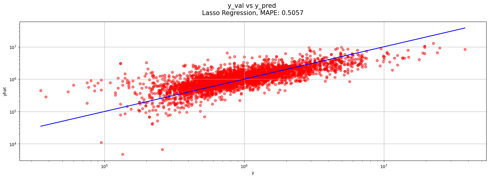
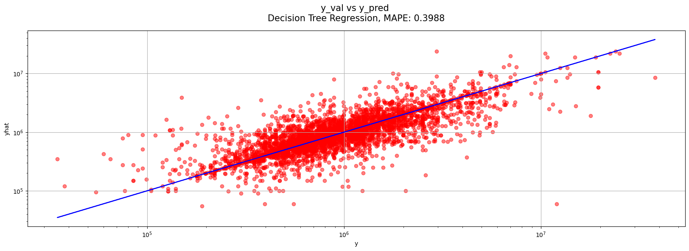
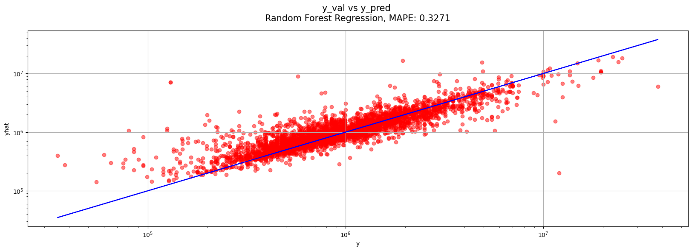
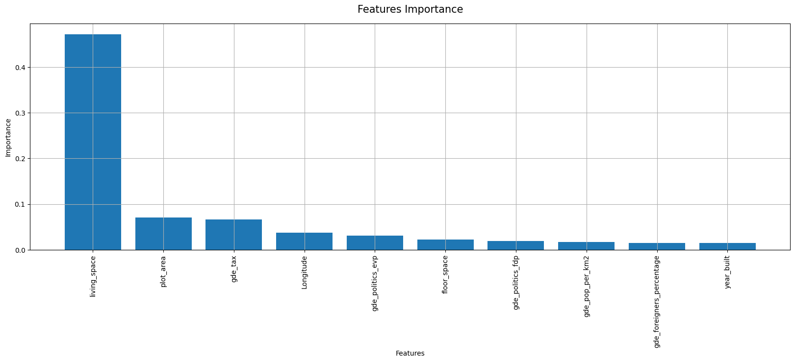
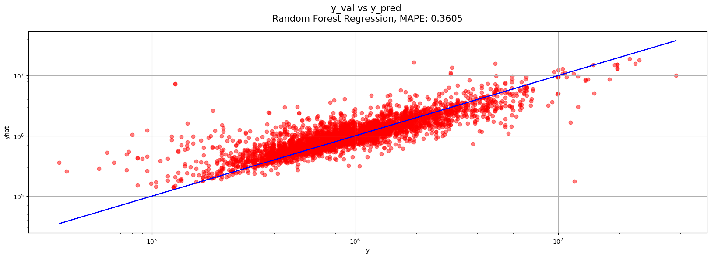

# Bestmögliches Regressionsmodell  kaggle-Contest

Challenge: cml1/3Db Immobilienrechner  
Team: Alexander Shanmugam, Si Ben Tran, Gabriel Torrez Gamez, Haris Alic  
Aufgabe: 2.2 Bestmögliches Regressionsmodell - kaggle-Contest  

Entwickle mit beliebigen Algorithmen das bestmögliche Modell im Sinne des mean absolute percentage error (MAPE). Vegleiche dabei mindestens drei algorithmische Ansätze, wobei ein multiples lineares Modell Teil davon sein soll als Benchmark. Untersuche die ‘Variable Importance’ für dein bestes Modell.

Abgabe

Notebook und daraus erstellter Bericht (ohne Code) als pdf, welche die Entwicklung deines besten Modells, sowie der zwei weiteren Modelle dokumentiert, inklusive verwendeter Features, Preprocessing, Model Selection Prozess und Untersuchung der ‘Variable Importance’.

Eingabe der Vorhersage des Preises für den Testdatensatz mit deinem bestmöglichen Modell auf kaggle.

---
# Pipeline
Um unsere Daten auf die Modelle vorzubereiten wurden die wichtigsten Module importiert, die Daten eingelesen, gesplittet, repariert, imputiert und skaliert. Weitere Informationen sind im Jupyter Notebook vorhanden.

---
# Modell 1 - Multiple Lineare Model
Modell 1 ist ein multiples lineares Modell, welches wir als Benchmark für die weiteren Modelle verwenden werden. Wir haben uns für dieses Modell entschieden, da es ein einfaches Modell ist, welches wir schnell erstellen können und es uns ermöglicht, die Vorhersage des Preises zu erstellen.
Die multiple lineare Regression ist ein statistisches Modell, das verwendet wird, um die Beziehung zwischen einer abhängigen und einer oder mehreren unabhängigen Variablen zu beschreiben. Es geht davon aus, dass die Beziehung zwischen den Variablen linear ist und dass die Zufallsfehler normalverteilt sind.

    Fitting 5 folds for each of 4 candidates, totalling 20 fits
    Best params: {'fit_intercept': False, 'positive': True}
    Mean absolute percentage error: 3187350940.2074747

Wir evaluieren alle unsere Modelle mit dem MAPE Score und zeigen mittels einer Visualisierung wie gut unser Modell den Immobilienpreis vorhersagen kann.  
In der Visualisierung wird der richtige Preis durch die x-Achse dargestellt. Die blaue Linie repräsentiert ein perfektes Modell. 
Sprich, wenn ein roter Punkt sich auf der blauen Linie befindet, so ist der vorhergesagte Wert identisch mit dem richtigen Wert. Dies wäre der Idealfall. 

Man erkennt in unserem Plot, dass das multiple Lineare Regressionsmodell die Werte der Preise eher unterschätzt, da die roten Punkte sich unterhalb der blauen Linie befinden. Auch erkennen wir vereinzelte Punkte, die sehr weit entfernt von der blauen Linien sind. Aus diesem Grund ist es auch nicht verwunderlich, dass unser MAPE Score einen sehr hohen Wert verzeichnet. 

---
# Modell 2 - Lasso Regression
Modell 2 ist ein multiples lineares Lasso Modell. Die Lasso Regression ist eine Art von Regression, die eine L1-Regularisierung verwendet. Diese Technik fügt dem Fehlerterm einen Penalty-Term hinzu, der die Summe der absoluten Werte der Regressionskoeffizienten minimiert. Lasso Regression kann verwendet werden, um automatisch unbedeutende Variablen auszuschließen und die Modellkomplexität zu reduzieren.

    Fitting 5 folds for each of 800 candidates, totalling 4000 fits
    Best parameters: {'alpha': 100000.0, 'fit_intercept': True, 'max_iter': 100, 'positive': False, 'random_state': 42, 'selection': 'cyclic'}
    Mean absolute percentage error: 0.5057373981991736

Wir erkennen im Plot eine deutliche Verbesserung mittels Lasso Regression, verglichen zum multiplen linearen Modell. Auch die MAPE Metrik ist deutlich gesunken auf 0.5. Da bei der Lasso Regression Features bestraft werden, die keinen Beitrag zur Vorhersage des Immobilienpreises haben, können wir hier schon die ersten wichtigen Features extrahieren. Sprich Features die keinen Koeffizienten Wert von 0 aufweisen. 

## Untersuchung der Variable Importance Modell 2

    Fitting 5 folds for each of 80 candidates, totalling 400 fits
    Best parameters: {'alpha': 100000.0, 'fit_intercept': True, 'max_iter': 100, 'positive': False, 'random_state': 42, 'selection': 'cyclic'}
    Mean absolute percentage error: 0.5057368618984887

Hier sehen wir, dass unser neues Modell mit weniger Features einen identischen MAPE Score hat.

---
# Modell 3 - Ridge Regression
Modell 3 ist ein multiples lineares Ridge Modell. Die Ridge Regression ist eine weitere Art von Regression, die eine L2-Regularisierung verwendet. Diese Technik fügt dem Fehlerterm einen Penalty-Term hinzu, der die Summe der Quadrate der Regressionskoeffizienten minimiert. Ridge Regression kann verwendet werden, um Probleme der Überanpassung (overfitting) zu vermeiden und die Robustheit des Modells zu verbessern.

    Fitting 5 folds for each of 400 candidates, totalling 2000 fits
    Best parameters: {'alpha': 10000.0, 'fit_intercept': True, 'max_iter': 100, 'positive': False, 'random_state': 42}
    Mean absolute percentage error: 0.5004054411589232

Wir schauen uns nun das Ridge Regression Modell an und erkennen, das auch hier die roten Punkte deutlich besser auf der blauen Linie liegen als beim multiplen Linearen Modell. Entsprechend ist auch der MAPE deutlich tiefer. Sowohl beim Lasso als auch bei der Ridge Regression können wir sagen, das der MAPE Score ähnlich ist und gleich gute Resultate liefert. Da ein MAPE von ca. 50% uns nicht genügt, verwenden wir weitere Modelle um unsere Vorhersage über den Immobilienpreis zu verbessern.

---
# Modell 4 - Elastic Net Regression
Modell 4 ist ein multiples lineares Elastic Net Modell. Elastic Net Regression ist eine Kombination aus Lasso- und Ridge-Regression. Es vereint die Vorteile beider Methoden, indem es eine Kombination der L1- und L2-Regularisierung verwendet. Dies ermöglicht es, unbedeutende Variablen auszuschließen und gleichzeitig die Modellkomplexität zu begrenzen.

    Fitting 5 folds for each of 240 candidates, totalling 1200 fits
    Best parameters: {'alpha': 100000.0, 'fit_intercept': True, 'l1_ratio': 1, 'max_iter': 100, 'positive': False, 'random_state': 42, 'selection': 'cyclic'}

Bei der Elastic Net Regression erkennen wir keine Verbesserung des MAPE Scores. Wir testen nun weitere Modelle mit unserem Datensatz.

---
# Modell 5 - KNN Regression
Modell 5 ist ein KNN Modell. Die KNN Regression (K-Nearest Neighbors Regression) ist ein nicht-parametrisches Modell, das verwendet wird um Vorhersagen auf der Grundlage von Beobachtungen in der Nachbarschaft der Datenpunkte vorzunehmen. Es geht davon aus, dass Beobachtungen, die in der Vergangenheit ähnlich waren, auch in der Zukunft ähnlich sein werden.

    Fitting 4 folds for each of 8 candidates, totalling 32 fits
    Best parameters: {'algorithm': 'ball_tree', 'leaf_size': 5, 'metric': 'minkowski', 'n_neighbors': 3, 'p': 1, 'weights': 'distance'}

Es ist sehr interessant zu sehen, dass die KNN Regression eine deutliche Verbesserung zur Vorhersage des Immobilienpreises beiträgt. Der MAPE ist deutlich gesunken und befindet sich nun im Bereich von 0.38. Die roten Punkte befinden sich nun nach und nach mehr auf der blauen Linie und unser Modell wird besser. Wir nutzen nun andere Modelle, um die Immobilienpreise besser vorhersagen zu können.

---
# Modell 6 - Decision Tree Regression
Modell 6 ist ein Decision Tree Modell. Die Decision Tree Regression ist ein Modell, das auf Entscheidungsbaum-Algorithmen basiert. Es ermöglicht ihm, eine Vorhersage anhand von Entscheidungen zu treffen, die anhand von Input-Variablen getroffen werden. Der Entscheidungsbaum besteht aus Knoten und Kanten, wobei jeder Knoten eine Entscheidung darstellt und die Kanten die möglichen Ergebnisse dieser Entscheidungen darstellen.

    Fitting 5 folds for each of 24 candidates, totalling 120 fits
    Best parameters: {'criterion': 'absolute_error', 'max_depth': None, 'max_features': None, 'min_samples_leaf': 1, 'min_samples_split': 2, 'random_state': 42, 'splitter': 'best'}

Der Decision Tree liefert und einen schlechteren MAPE Score als der aus der KNN Regression. Trotzdem ist dieser interessant für uns, um zu schauen ob die Feature Importance ähnlich oder gleich ist, wie die von der Lasso Regression. Im nächsten Abschnitt extrahieren wir die wichtigsten Features und plotten diese in einem Barplot und schauen uns an, ob sich der MAPE Score verschlechtert.

## Untersuchung der Variable Importance Modell 6

    Fitting 5 folds for each of 24 candidates, totalling 120 fits
    Best parameters: {'criterion': 'poisson', 'max_depth': None, 'max_features': None, 'min_samples_leaf': 1, 'min_samples_split': 2, 'random_state': 42, 'splitter': 'best'}

Wir nutzen nun die wichtigsten Features der Lasso Regression und verwenden unseren Decision Tree Regressor und schauen uns an, wie sich der MAPE Score mit anderen Features verändert. 

    Fitting 5 folds for each of 24 candidates, totalling 120 fits
    Best parameters: {'criterion': 'squared_error', 'max_depth': None, 'max_features': 'sqrt', 'min_samples_leaf': 1, 'min_samples_split': 2, 'random_state': 42, 'splitter': 'random'}

Durch die Auswahl der wichtigsten Features von der Lasso Regression, erhalten wir einen schlechteren MAPE Score als mit den wichtigsten Features vom Decision Tree selbst.  

---
# Modell 7 - Random Forest Regression
Modell 7 ist ein Random Forest Modell. Random Forest Regression ist ein Ensemble-Modell, das auf mehreren Entscheidungsbäumen basiert. Es erstellt mehrere Entscheidungsbäume und verwendet dann die durchschnittlichen Vorhersagen aller Bäume, um die endgültige Vorhersage zu erhalten. Durch die Verwendung mehrerer Bäume wird das Risiko von Überanpassung (overfitting) reduziert und die Vorhersagen werden stabiler und zuverlässiger.

    Fitting 4 folds for each of 1 candidates, totalling 4 fits
    Best parameters: {'max_depth': None, 'max_features': None, 'min_samples_leaf': 1, 'min_samples_split': 2, 'n_estimators': 100, 'random_state': 42}

## Untersuchung der Variable Importance Modell 7

Analog wie beim Modell 6 sehen wir, dass living_space das wichtigste Feature ist, um den Immobilienpreis vorhersagen zu können. Wir erstellen im nächsten Schritt das gleiche Modell, nur mit den wichtigsten Features. Erwartungsgemäss verschlechtert sich der MAPE einwenig.

    Fitting 4 folds for each of 1 candidates, totalling 4 fits
    Best parameters: {'max_depth': None, 'max_features': None, 'min_samples_leaf': 1, 'min_samples_split': 2, 'n_estimators': 100, 'random_state': 42}

Nun nehmen wir die wichtigsten Features aus dem Modell Decision Tree und Lasso Regression.

Decision Tree Features:

    Fitting 4 folds for each of 1 candidates, totalling 4 fits
    Best parameters: {'max_depth': None, 'max_features': None, 'min_samples_leaf': 1, 'min_samples_split': 2, 'n_estimators': 100, 'random_state': 42}

Lasso Features:

    Fitting 4 folds for each of 1 candidates, totalling 4 fits
    Best parameters: {'max_depth': None, 'max_features': None, 'min_samples_leaf': 1, 'min_samples_split': 2, 'n_estimators': 100, 'random_state': 42}

Wie wir durch unsere Modelle und Plots zeigen konnten, lässt sich vieles vereinfachen indem wir nur die wichtigsten Features aus unserem Datensatz nehmen und entsprechend trainieren und validieren. 

Eine interessante Beobachtung ist, dass alle wichtigen Features von Lasso, Decision Tree und Random Forest Tree zu fast gleichen MAPE Scores führen. Durch die Selektion der wichtigsten Features, können wir unsere Modelle vereinfachen und die Performance verbessern.

---
# Modell 8 - Gradient Boosting Regression
Modell 8 ist ein Gradient Boosting Modell. Gradient Boosting Regression ist ein weiteres Ensemble-Modell, das auf Gradient Boosting-Algorithmen basiert. Es erstellt mehrere schwache Modelle und fügt sie dann schrittweise zu einem stärkeren Modell zusammen, indem es sich auf Fehler des vorherigen Modells fokussiert. GBR ist ein sehr mächtiges Modell, aber es kann leicht zu Überanpassung (overfitting) führen, falls nicht sorgfältig reguliert wird.

    Fitting 5 folds for each of 1 candidates, totalling 5 fits
    Best parameters: {'learning_rate': 0.1, 'max_depth': 12, 'min_samples_leaf': 1, 'min_samples_split': 2, 'n_estimators': 100, 'random_state': 42}

Der Gradient Boosting Regressor liefert uns einen ähnlichen MAPE Score wie der Random Forest. Beide MAPE Scores liegen im Bereich von 0.32.

---
# Modell 9 - XGBoost Regression
Modell 9 ist ein XGBoost Modell. XGBoost Regression ist ein weiteres Ensemble-Modell, das auf Gradient Boosting-Algorithmen basiert. Es ist speziell für die Beschleunigung von Gradient Boosting und für die Handhabung von großen Datensätzen optimiert. Es bietet mehrere fortgeschrittene Funktionen wie automatisches Ressourcen-Management und reguläre Optimierungen.

    Fitting 4 folds for each of 1 candidates, totalling 4 fits
    Best parameters: {'booster': 'gbtree', 'learning_rate': 0.1, 'max_depth': 15, 'random_state': 42}

Durch XGBoost konnten wir unseren MAPE Score nochmals um 2 Prozent verbessern. Der MAPE Score liegt nun im Bereich von 0.30.

---
# Modell 10 - Histgradientboosting Regression (log transformation)
Modell 10 ist ein Histgradientboosting Modell. HistGradientBoosting Regression ist eine spezielle Art der Gradient Boosting Regression, die von Gradient Boosting-Algorithmen für große Datensätze und hohe Dimensionen optimiert ist. Es nutzt eine besondere Technik namens Histograms, welche es ermöglicht effizient mit numerischen Features umzugehen und so die Rechenzeit zu reduzieren.

    Fitting 4 folds for each of 1 candidates, totalling 4 fits
    Best parameters: {'learning_rate': 0.1, 'loss': 'absolute_error', 'max_depth': 18, 'max_leaf_nodes': None, 'random_state': 42}

Mit dem Histgradientboosting können wir nun einen MAPE Score von 0.26 liefern, was deutlich besser ist als alle unsere anderen Modelle. Da der Histgradientboosting auch mit NA Werten umgehen kann, werden wir dies im nächsten Abschnitt durchführen und schauen was für einen MAPE wir erhalten.

---
# Modell 11 - Histgradientboosting Regression (log transformation) with NA
Unser Vorheriges Modell kann mit NA Werten umgehen. Neu trainieren wir es auf nicht imputierte Werte.

    Fitting 4 folds for each of 1 candidates, totalling 4 fits
    Best parameters: {'learning_rate': 0.1, 'loss': 'absolute_error', 'max_depth': 25, 'max_leaf_nodes': None, 'random_state': 42}

Dies ist unser bestes Modell. Mit Histgradientboosting, Log Transformation und NA Werten erreicht unser Modell den tiefsten MAPE Score auf unserem Validierungsdatensatz mit 0.23. Wir erkennen im Plot, dass die meisten roten Punkte sich im Bereich der blauen Linie aufhalten. Im oberen und tieferen Bereich streuen die Punkte von der Linie einwenig ab. Dies bedeutet, dass wir die besten Vorhersagen im mittleren Bereich unserer Immobilienpreise liefern können.

---
# Vergleiche der Modelle
Hier werden die Modelle miteinander verglichen und tabellarisch sowie visuell dargestellt.
Dabei dient das Modell 1 "Multiple lineare Regression", als Benchmark.

| Model                                   | MAPE          |
| --------------------------------------- | ------------- |
| HistGradientBoosting Regression with NA | 0.233239      |
| HistGradientBoosting Regression         | 0.260161      |
| XGBoost Regression                      | 0.304185      |
| GradientBoosting Regression             | 0.319968      |
| RandomForest Regression                 | 0.327054      |
| KNeighbors Regression                   | 0.382445      |
| DecisionTree Regression                 | 0.418579      |
| Ridge Regression                        | 0.500405      |
| Lasso Regression                        | 0.505737      |
| ElasticNet Regression                   | 0.505737      |
| Multiple Linear Regression              | 3187350940.20 |

Wir erkennen im Barplot deutlich, das alle Modelle besser sind als die multiple lineare Regression. Schon unser zweites Modell, das Lasso Modell schlägt unseren Benchmark um ein Vielfaches. Das beste Modell, welches wir für unsere Preisvorhersage nutzen ist HistGradientBoostingRegression. Dicht gefolgt vom gleichen Modell, jedoch ohne mit NA Werten umgehen zu können. Bei beiden HistGradientBoosting Modellen transformieren wir die Target Variable. Auf dem dritten Platz befindet sich das XGBoost Modell. Alle drei Modelle liefern uns einen sehr guten MAPE Score bei unserem Validierungsdatensatz. Auf Kaggle haben wir unterschiedliche Modelle eingereicht und auch hier, analog zum Testdatensatz, liefert die HistGradientBoostingRegression mit NA Werten die besten Resultate in Bezug auf den MAPE Score.

---
# Untersuchung der "Variable Importance" 
Wir konnten aus unserem besten Modell die Variable Importance nicht extrahieren. Aus diesem Grund haben wir die Variable Importance von unserem zweitbesten Modell, dem xgboost Modell extrahiert und diese dann mittels Barplot visualisiert. 

Es ist sehr interessant zu sehen, das dass xgboost Modell das Feature gde_tax als höchstes bewertet. Verglichen zu den Lasso, Decision Tree und Random Forest Modellen, ist dort living_space das wichtigste Feature. xgboost bewertet living_space jedoch als zweit wichtigstes Feature. Dies ist im Barplot deutlich ersichtlich.

---
# Fazit
Wir konnten in diesem Notebook unsere Kenntnisse mit verschiedenen sklearn Modellen verbessern und erweitern. Es hat uns Spass gemacht, Stück für Stück den MAPE Score zu optimieren und unterschiedliche Regression Modelle anzuwenden und den MAPE von jedem Modell zu vergleichen. 

Unser letztes Modell, der HistGradientBoostingRegressor mit NA Werten liefert uns den besten MAPE Score. Wir haben uns entschieden dieses Modell zu verwenden, da es uns die Möglichkeit gibt, mit NA Werten umgehen zu können. Dies hat einen grossen Vorteil, da wir uns nicht mit den NA Werten, wie bei allen anderen Modellen herumschlagen müssen. Nach aktuellem Stand (11.01.2023), stehen wir auch im Leaderboard auf Kaggle auf dem ersten Platz.